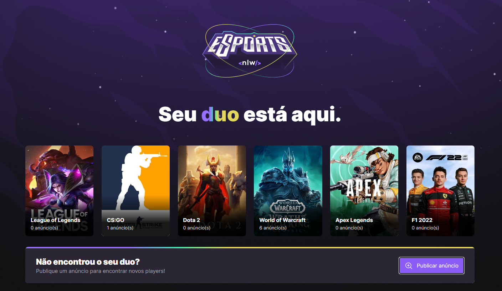
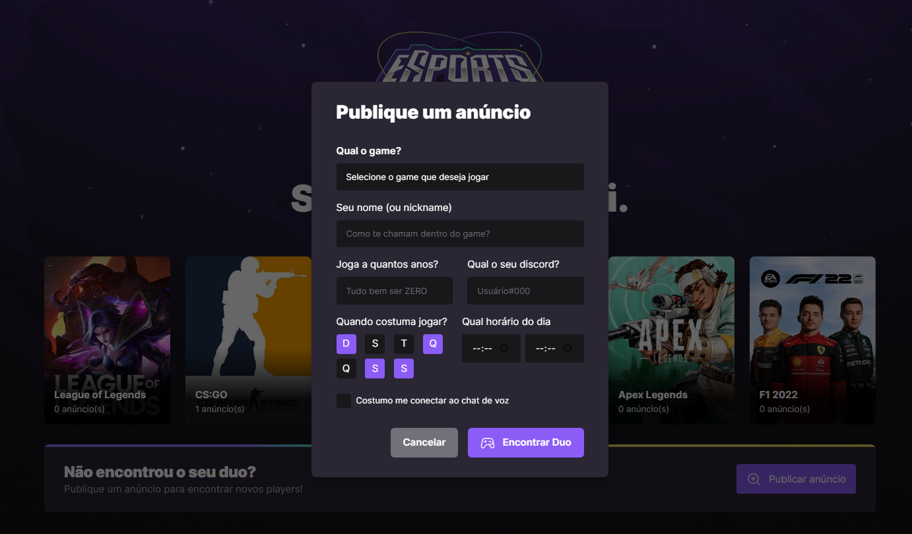
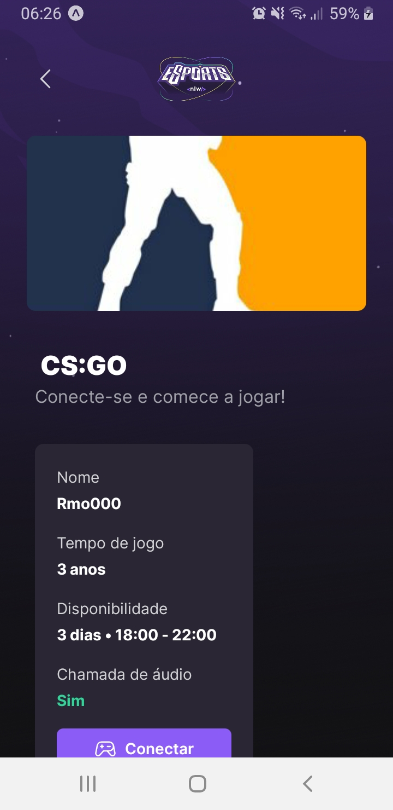
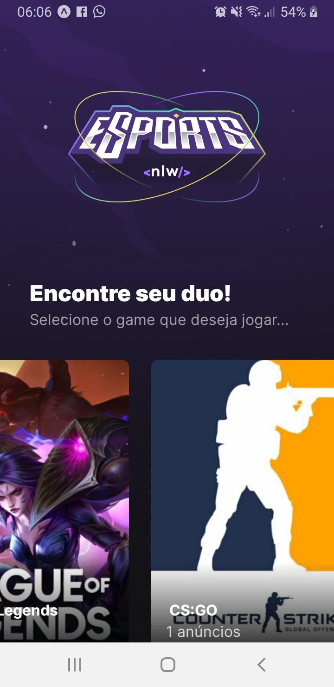
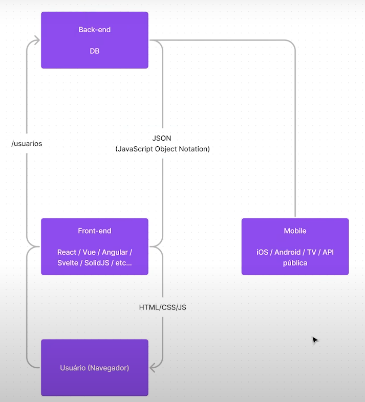

<p align="center">
  
</p>

<h1 align="center">
    
    
</h1>

<h1 align="center">
    
    
</h1>

<br>

## 🧪 Tecnologias

Esse projeto foi desenvolvido com as seguintes tecnologias:

- [React](https://reactjs.org)
- [React Native](https://reactnative.dev/)
- [TypeScript](https://www.typescriptlang.org/)
- [SQLite](https://www.sqlite.org/index.html)
- [Prisma](https://www.prisma.io/)
- [Express](https://expressjs.com/pt-br/)
- [Expo](https://expo.dev/)
- [Radix-ui](https://www.radix-ui.com/)
- [Axios](https://axios-http.com/ptbr/docs/intro)
- [Phosphor-react](https://phosphoricons.com/)
- [Vite](https://vitejs.dev/)
- [Tailwindcss](https://tailwindcss.com/)
- [Nodejs](https://nodejs.org/en/)

## 🚀 Como executar

O projeto foi desenvolvido pensando em ter apenas um backend para diferentes frontends, como demosntra o diagrama abaixo:

<h1 align="center">
  
</h1>

Primeiro clone o projeto:

```bash
$ git clone https://github.com/rmo000/nlw-esports.git
$ cd nlw-esports
```

Depois inicie o backend:
```bash
$ cd server
# Instalar as dependências
$ npm install

# Iniciar o backend
$ npm run dev
```
O backend estará disponível no endereço http://localhost:3333.

Inicie o frontend Web:

```bash
#abra outro terminal e navegue até a pasta do projeto
$ cd web

# Instalar as dependências
$ npm install

# Iniciar o frontend
$ npm run dev
```

Inicie o frontend Mobile:

```bash
#abra outro terminal e navegue até a pasta do projeto
$ cd mobile

# Instalar as dependências
$ npm install

# Iniciar o frontend
$ expo start
```
**No ambiente mobile será necessário instalar o aplicativo Expo Go para testar o app pelo seu próprio celular. 
Após instalar basta escanear o QR Code**

## 💻 Projeto

NLW eSport é um projeto que proporciona um encontro do discord de pessoas para jogar os seus jogos favoritos juntos. 

Este é um projeto desenvolvido durante a **[Next Level Week eSport]**, apresentada dos dias 11 a 18 de Junho de 2022.


## 🔖 Layout

Você pode visualizar o layout do projeto através do link abaixo:

- [Layout Web](https://www.figma.com/community/file/1150897317533332617) 

Lembrando que você precisa ter uma conta no [Figma](http://figma.com/).

## 📝 License

Esse projeto está sob a licença MIT. Veja o arquivo [LICENSE](LICENSE.md) para mais detalhes.

---

Feito com 💜 by Rocketseat 👋🏻 [Participe da comunidade da Rocketseat](https://discord.gg/gKUVrzrPrU)
